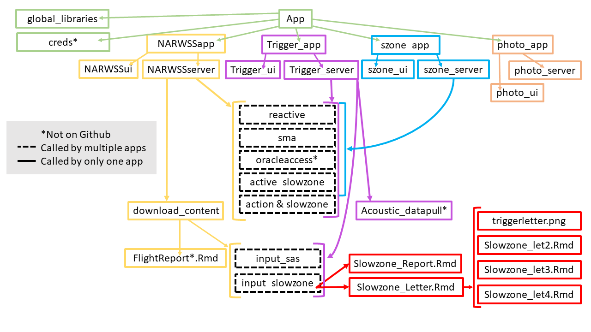

# narwss_rwsas_apps

[](https://doi.org/10.21105/joss.05436)
[](https://doi.org/10.5281/zenodo.8127594)

Welcome to the [North Atlantic Right Whale Sighting Survey (NARWSS)](https://www.fisheries.noaa.gov/new-england-mid-atlantic/marine-mammal-protection/whale-and-dolphin-research-northeast#north-atlantic-right-whale-sighting-surveys) and the [Right Whale Sighting Advisory System (RWSAS)](https://www.fisheries.noaa.gov/new-england-mid-atlantic/marine-mammal-protection/whale-and-dolphin-research-northeast#right-whale-sighting-advisory-system) apps repository!

The NARWSS 'Aerial Survey Data Processing' tool, and the RWSAS 'Trigger Analysis' tool improve the workflow between data processing and the determination of potential [Right Whale Slow Zones](https://www.fisheries.noaa.gov/national/endangered-species-conservation/reducing-vessel-strikes-north-atlantic-right-whales). These tools provide a platform to efficiently process survey data to help eliminate sources of human error, integrate currently active management zones, determine if trigger criterion for a new dynamic protection zone have been met, calculate the boundaries of a proposed Slow Zone, and compile reports that are then sent on to managers and other stakeholders.

The tools described here were developed for scientists at the [Northeast Fisheries Science Center (NEFSC)](https://www.fisheries.noaa.gov/about/northeast-fisheries-science-center) in their role as data stewards to support federal managers at the [Greater Atlantic Regional Fisheries Office](https://www.fisheries.noaa.gov/about/greater-atlantic-regional-fisheries-office); however, the data processing and reporting procedure will be of interest to wildlife survey and management teams with similar objectives. Additionally, these publicly available tools provide transparency and reproducibility of the process for declaring dynamic protection zones in the Northeast United States. These tools were written primarily using the R coding language and specifically leverage the 'Shiny' package.

For more info on the suite of apps in this repo, please check out the [Wiki](https://github.com/NEFSC/READ-PSB-LWT-narwss_rwsas_apps/wiki) as well as [this section in this NEFSC Shiny Book](https://nefsc.github.io/NEFSC-shiny-book/shiny-apps.html#northeast-right-whale-shiny-apps). 

## Getting Started

### Additional installations for downloading PDFs

`webshot::install_phantomjs()`

`install.packages('tinytex')`

`tinytex::install_tinytex()`

If you do not get TRUE when you run `tinytex:::is_tinytex()`, then you probably need to run this: `tinytex::install_tinytex(force=TRUE)`. More info on this process and the TinyTex package can be found here: https://yihui.name/tinytex/. Note the difference between tinytex the R package and TinyTeX the LaTeX distribution. Both commands above are needed. 

### Troubleshooting PDF downloads

If after doing the installations above you are still having trouble downloading PDFs, there are options to compile the report as an html page. See this [section of the wiki](https://github.com/NEFSC/READ-PSB-LWT-narwss_rwsas_apps/wiki/Aerial-Survey-Processing-App,-Aerial-Survey-Tab:-Part-3). Different computers have different setups related to LaTeX distributions which might be causing the issue.

## Running the App
The app can be launched by running

`shiny::runGitHub("READ-PSB-LWT-narwss_rwsas_apps", username = "NEFSC", ref = "master")`

in your RStudio environment. Click 'Run App' to get started. In the window that pops up, click "Open in Browser". 

To run the offline version of the app that emulates the NEFSC server (for NOAA employees running data post-processing), run

shiny::runGitHub("READ-PSB-LWT-narwss_rwsas_apps", username = "NEFSC", ref = "container")`

### Example data

To take a spin with processing example aerial survey data and evaluating if sightings trigger SLOW zones, chose/enter the following details (NOTE: to download the report, you will have to host the [example data](https://github.com/NEFSC/READ-PSB-LWT-narwss_rwsas_apps/tree/master/example_data/210409) on a local path specific to your machine, and the SLOW zone analysis will then not be available):


### There are several scenarios available to explore with different example survey days:

* 210226: Visual sightings that fall within a Seasonal Management Area. One flight day, includes option to load previously editted eff/sig file.
* 210407: Visual sightings that trigger a new SLOW Zone. One flight day, includes option to load previously editted eff/sig file.
* 210409: Visual sightings that extend two active and overlapping SLOW Zones. Two flight day, no editted eff/sig file.
* 210512: Visual sightings that fall within active SLOW Zones, but trigger no further action. One flight day, includes option to load previously editted eff/sig file.

## Script Structure
```
app.R                       Starting App file that defines the dashboard for all apps in this repo
scripts/
  global_libraries.R        Required libraries
  creds.R*                  Allowable credentials defined for accessing the Shiny app on the network server
  
  NARWSSapp.R               App file for the North Atlantic Right Whale Sighting Survey (NARWSS)vAerial Survey Processing App
  NARWSSui.R                User interface for the NARWSS Aerial Survey Processing App
  NARWSSserver.R            Server code for NARWSS Aerial Survey Processing App
  
  Trigger_app.R             App file for the Trigger Analysis App
  Trigger_ui.R              User interface for the Trigger Analysis App
  Trigger_server.R          Server code for the Trigger Analysis App
    
  szone_app.R               App file for the Slow Zone viewer App
  szone_ui.R                User interface for the Slow Zone viewer App
  szone_server.R            Server code for the Slow Zone viewer App
  
  photo_app.R               App file for the Photo Position Finder App
  photo_ui.R                User interface for the Photo Position Finder App
  photo_server.R            Server code for the Photo Position Finder App

-- Files called by the server for the NARWSS Aerial Survey Processing App, Trigger Analysis App, and the Slow Zone viewer App --
  reactive.R                Reactive values passed between different actions
  sma.R                     Determines active Seasonal Management Areas based on the date
  oracleaccess.R*           Credentials for accessing Oracle database
  active_slowzone.R         Determines active Slow Zones based on the date
  action & slowzone.R       Procedure for determining action codes and triggered Slow Zones for right whale detections

-- Files called by the server for the NARWSS Aerial Survey Processing App --  
  download_content.R        Content passed to download handler for flight report
  FlightReport.Rmd          Template flight report

-- Files called by the server for the NARWSS Aerial Survey Processing App and the Trigger Analysis App --  
  input_sas.R               Detections formatted and uploaded to the Sighting Advisory System
  input_slowzone.R          Triggered Slow Zone data formatted and uploaded to the database
    slowzone_Report.Rmd     Template for Slow Zone report
    slowzone_Letter.Rmd     Template for Slow Zone letter. Conditionally cycles through slowzone_let#.Rmd if more than one Slow Zone is triggered from one flight or on one day

-- Files called by the server for the Trigger Analysis App --
  Acoustic_datapull.R*      Queries right whale acoustic detections based on selected date  

*not managed on GitHub
```
## Script Flow Chart



## Contributions

In the [NEFSC Shiny Book](https://nefsc.github.io/NEFSC-shiny-book/shiny-apps.html#northeast-right-whale-shiny-apps), you can find the point of contact for questions regarding this repository. In addition, problems can be reported, suggestions can be submitted, and questions can be asked via [this repository's issue tab](https://github.com/NEFSC/READ-PSB-LWT-narwss_rwsas_apps/issues). 

For substantial suggestions/changes, please first open the discussion by submitting an [issue](https://github.com/NEFSC/READ-PSB-LWT-narwss_rwsas_apps/issues).

This project, and everyone participating in it, is governed by [this Code of Conduct](https://github.com/nmfs-fish-tools/Resources/blob/main/CODE_OF_CONDUCT.md). By participating, you are expected to uphold this code.

##

This repository is a scientific product and is not official communication of the National Oceanic and Atmospheric Administration, or the United States Department of Commerce. All NOAA GitHub project code is provided on an ‘as is’ basis and the user assumes responsibility for its use. Any claims against the Department of Commerce or Department of Commerce bureaus stemming from the use of this GitHub project will be governed by all applicable Federal law. Any reference to specific commercial products, processes, or services by service mark, trademark, manufacturer, or otherwise, does not constitute or imply their endorsement, recommendation or favoring by the Department of Commerce. The Department of Commerce seal and logo, or the seal and logo of a DOC bureau, shall not be used in any manner to imply endorsement of any commercial product or activity by DOC or the United States Government.


