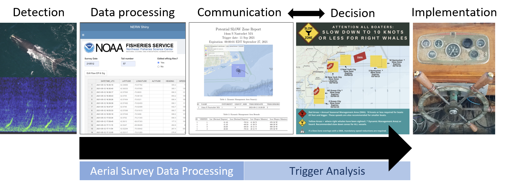

# Summary

Conservation strategies aimed at protecting the Critically Endangered North Atlantic right whale (*Eubalaena glacialis*, hereafter 'right whale') [@CookeIUCN2020] in the United States currently include static and dynamic management measures to mitigate vessel strikes [@NMFS:2013]. This species predominately lives along the eastern seaboard of the United States and Canada where their habitat overlaps with busy shipping ports [@vesselspeedrule2020]. Vessel strikes, along with entanglements in fishing gear, are a leading cause of right whale mortality and the downward trajectory of this species' population size over the last decade [@corkeron2018recovery; @sharp2019gross; @narwc2022]. Seasonal Management Areas (SMAs) are static geographic areas where vessels larger than 65 ft (19.8 m) are required to limit their speed to 10 kts or less at prescribed, annual periods [@NMFS:2008; @NMFS:2013]. Dynamic Right Whale Slow Zones are declared when a threshold density of right whales is detected visually (Dynamic Management Areas, DMAs) [@NMFS:2008; @NMFS:2013] or acoustically (Acoustic Slow Zones) outside of active SMAs [@NOAAFisheries:2020], and within these zones, the vessel speed restriction is voluntary[^1]. The boundaries of dynamic Slow Zones are determined by where the detections occur, and for visual detections, the number of right whales sighted also factors into the calculated size of the area [@NMFS:2008; @NMFS:2013; @NOAAFisheries:2020].

[^1]: On 1 August 2022, the US National Marine Fisheries Service proposed amendments to the North Atlantic Vessel Strike Reduction Rule that would make dynamic speed restriction zones mandatory (87 FR 46921)

The vessel speed restriction ruling was first put into place in late 2008 [@NMFS:2008], but beginning around 2010, a range-wide distribution shift occurred for the species [@davis2017long], and right whales were increasingly sighted in regions without existing static protections [@DAVIES2019157; @quintana2021residency]. This change in habitat use has been attributed to a climate-driven shift in right whale prey [@Meyer-Gutbrod:2021], and put pressure on dynamic measures to provide some level of protection in these areas outside of SMAs (Fig. 1). The shift in right whale habitat use motivated the integration of additional ways to detect the presence of right whales [@NOAAFisheries:2020], and passive acoustic detections of right whale vocalizations reported in near real-time became an increasingly important tool to supplement visual sightings [@baumgartner2019persistent]. In late 2020, a program was introduced that expanded dynamic management by triggering Slow Zones in response to acoustic detections of right whale vocalizations [@NOAAFisheries:2020; @van2021noaa].

# Statement of need

The expansion of the dynamic management conservation strategy, as well as the increase in detection of right whales outside of SMAs, called for tools to: 1) streamline the process of handling multiple streams of right whale detection data, 2) refine and modernize the process of determining if the trigger criteria for dynamic measures were met, 3) quickly and accurately calculate the boundaries of a proposed Slow Zone, and 4) communicate this information to federal managers in near real-time.

The North Atlantic Right Whale Sighting Survey (NARWSS) 'Aerial Survey Data Processing' tool, and the Right Whale Sighting Advisory System (RWSAS) 'Trigger Analysis' tool improve the workflow between data processing and the determination of potential Right Whale Slow Zones (Fig. 2). These tools provide a platform to efficiently process survey data to help eliminate sources of human error, integrate currently active management zones, determine if trigger criterion for a new dynamic protection zone have been met, calculate the boundaries of a proposed Slow Zone, and compile reports that are then sent on to managers and other stakeholders.

The tools described here were developed for scientists at the Northeast Fisheries Science Center (NEFSC) in their role as data stewards to support federal managers at the Greater Atlantic Regional Fisheries Office; however, the data processing and reporting procedure will be of interest to wildlife survey and management teams with similar objectives. Additionally, these publicly available tools provide transparency and reproducibility of the process for declaring dynamic protection zones in the Northeast United States. These tools were written primarily using the R coding language [@Rlanguage] and specifically leverage the 'Shiny' package [@shiny].

# 'Aerial Survey Data Processing'

Current aerial survey data collection software used by the NEFSC renders three relevant files at the end of a flight: a Global Positioning System (GPS) file that logs time and position at a determined sampling rate, an effort file that contains recorded changes in weather conditions and survey mode, and a sightings file that includes information on animal sighting details including species, group size, and position. The 'Aerial Survey Data Processing' tool provides a platform that merges these files together, and provides a user interface to edit and visualize the survey data via interactive maps and spreadsheets. Finally, this tool compiles the survey data into the format necessary for integration into a long-term database, and renders a PDF or HTML summary report.

# 'Trigger Analysis'

The 'Trigger Analysis' tool evaluates whether a dynamic Slow Zone should be declared based on either visual or acoustic detections. The tool accesses detections from several sources, including governmental, educational, military, commercial, and non-profit institutions, in addition to the general public, which are stored in internal and external databases. Visual and acoustic detection data are evaluated on a daily scale to determine if the trigger criterion has been met. Acoustic slow zones are triggered when three or more upcalls (an acoustic vocalization that is common for this species and is known to be made by all ages and sex classes [e.g. @parks2011sound; @van2021noaa]) are acoustically detected within a 15-minute period, and DMAs are triggered when a minimum density of 4 whales per 100 nm$^2$ are observed. Both criterion must occur spatially outside of active SMAs and dynamic Slow Zones to trigger a new area, and can potentially extend the time period of active dynamic zones (see Fig. 3 for the decision making process built into the tool). When a dynamic Slow Zone is triggered, this tool will determine the boundaries of the zone and name it relative to the closest port or landmark. Both a letter to federal managers proposing the zone, as well as a report describing the potential zone, are generated as PDFs, and the data describing the zone are uploaded to an internal database.

# Conclusion

The NARWSS data processing and RWSAS trigger analysis tools have been part of the NEFSC Right Whale team workflow since 2017, and have been greatly refined and improved in the years since. Other applications, including one used for dynamic management in eastern Canada [@ratelle], have been modeled after these tools. Due to the dire status of the North Atlantic right whale, new conservation strategies are being discussed to improve outlooks for their recovery, including a proposed ruling to make speed restrictions within dynamic Slow Zones mandatory and applicable to smaller vessels (87 FR 46921). Reproducible tools that reduce sources of human error and streamline the evaluation of trigger criteria are vital to the timely implementation of protection measures.

# Acknowledgements

We acknowledge thoughtful testing and critiques from Allison Henry, Christin Khan, and Pete Duley. We additionally thank Hansen Johnson, Genevieve Davis, Beth Josephson, Peter Corkeron, the 'Shiny' people at the Northeast Fisheries Science Center (particularly Andy Beet, Kim Bastille, Josh Hatch, Dave Hiltz, and Alicia Miller), and Brigid McKenna/Center for Coastal Studies right whale aerial survey team.

# Figures

{width="70%"}

{width="90%"}

{width="90%"}

# References
